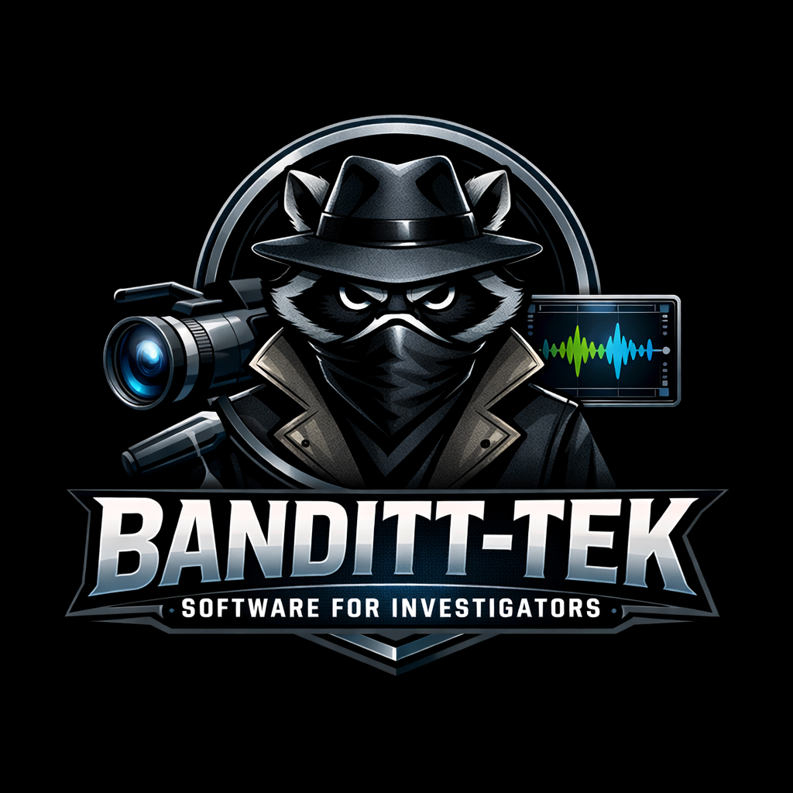

# Banditt-Tek EchoTrace

**AI-Enhanced Audio & Video Transcription for Investigators**

<p align="center">
  
</p>

EchoTrace combines AI-powered transcription with an Express Scribe-style correction editor. The AI does the heavy lifting, then you review, correct, and export — all in one tool.

Built for private investigators, law enforcement, legal professionals, and anyone who needs accurate, timestamped transcripts from audio and video files.

---

## Features

- **AI Transcription** — Local, offline transcription powered by [faster-whisper](https://github.com/SYSTRAN/faster-whisper). No data leaves your machine.
- **Speaker Detection** — Automatic speaker diarization via [pyannote.audio](https://github.com/pyannote/pyannote-audio). Labels each voice as Speaker 1, Speaker 2, etc.
- **Built-in Video Player** — Side-by-side video and transcript for body cam, interview, and surveillance footage. Resizable split panel.
- **Express Scribe-Style Editor** — Play/pause/rewind with hotkeys (F5/F6/F7), variable speed (0.5x–2.0x), click-to-seek on timestamps, and inline text editing.
- **Foot Pedal Support** — Works with USB foot pedals mapped to F5/F6/F7.
- **Speaker Name Editing** — Rename "Speaker 1" to "Officer Smith" directly in the transcript. Edits persist through save/load.
- **Project Save/Load** — Save your work as `.echotrace` files and resume editing later.
- **Multiple Export Formats** — Export corrected transcripts to TXT, DOCX, JSON, or PDF.
- **Dark Theme** — Professional investigator-branded interface.

---

## Quick Start

### Prerequisites

- **Windows 10/11**
- **Python 3.10+** — [Download](https://python.org) (check "Add to PATH" during install)
- **FFmpeg** — Install via PowerShell: `winget install ffmpeg`

### Install & Run

1. Clone the repository:
   ```
   git clone https://github.com/bandittfb/EchoTrace.git
   cd EchoTrace
   ```

2. Double-click **`run.bat`**

   First run automatically:
   - Creates a Python virtual environment
   - Installs all dependencies
   - Downloads the Whisper transcription model (~140 MB)

3. Drop an audio or video file onto the window, or click **Browse Audio...**

### Speaker Detection Setup (Optional)

Speaker detection requires a free [HuggingFace](https://huggingface.co) account:

1. Create an account at [huggingface.co](https://huggingface.co)
2. Accept the model terms:
   - [pyannote/speaker-diarization-3.1](https://huggingface.co/pyannote/speaker-diarization-3.1)
   - [pyannote/segmentation-3.0](https://huggingface.co/pyannote/segmentation-3.0)
3. Create an access token at [Settings > Access Tokens](https://huggingface.co/settings/tokens)
4. Create a `.env` file in the EchoTrace folder:
   ```
   HF_TOKEN=hf_your_token_here
   ```

---

## Usage

### Phase 1: Transcription

- Drop an audio/video file onto the app or click **Browse Audio...**
- Select a model size (larger = more accurate, slower):
  | Model | Speed | Accuracy | Download |
  |-------|-------|----------|----------|
  | tiny | Fastest | Basic | ~75 MB |
  | base | Fast | Good | ~140 MB |
  | small | Medium | Better | ~460 MB |
  | medium | Slow | Great | ~1.5 GB |
  | large-v3 | Slowest | Best | ~3 GB |
- Toggle **Speaker Detection** on/off
- Wait for processing (enjoy the fun facts while you wait)

### Phase 2: Correction Editor

- **F5** — Play / Pause
- **F6** — Rewind 5 seconds
- **F7** — Forward 5 seconds
- **Click a timestamp** — Jump to that point in the audio/video
- **Edit text inline** — Fix transcription errors directly
- **Rename speakers** — Change `Speaker 1:` to a real name like `Officer Smith:`
- **Delete lines** — Remove irrelevant segments (video stays synced)
- **Speed buttons** — Slow down to 0.5x for difficult audio
- **Save Project** — Save as `.echotrace` to resume later
- **Export** — TXT, DOCX, JSON, or PDF

### Resuming a Project

- Click **Open Project...** on the start screen
- Select your `.echotrace` file
- If the original media file moved, you'll be prompted to locate it

---

## Supported Formats

**Audio:** MP3, WAV, M4A, FLAC, OGG, WMA, AAC

**Video:** MP4, MKV, WebM, AVI, MOV, WMV, FLV, M4V

---

## File Structure

```
EchoTrace/
  transcribe_app.py    # Main window and application entry point
  editor.py            # Express Scribe-style correction editor
  audio_player.py      # Media player wrapper (audio + video)
  transcriber.py       # AI transcription and speaker diarization
  exporters.py         # Export to TXT, DOCX, JSON, PDF
  models.py            # Data models (Segment, TranscriptDocument)
  theme.py             # Dark theme and branding
  waiting_widget.py    # Animated waiting screen
  fun_facts.py         # Investigation facts, tips, and quotes
  requirements.txt     # Python dependencies
  run.bat              # Windows launcher
  .env                 # HuggingFace token (not committed)
```

---

## Dependencies

| Package | Purpose |
|---------|---------|
| PySide6 | GUI framework with built-in video player |
| faster-whisper | Local AI transcription |
| pyannote.audio | Speaker diarization |
| python-docx | Word document export |
| fpdf2 | PDF export |

---

## License

Proprietary — Banditt-Tek Software for Investigators

---

<p align="center">
  <b>Banditt-Tek</b> — Software for Investigators<br>
  <a href="https://github.com/bandittfb/EchoTrace">github.com/bandittfb/EchoTrace</a>
</p>
